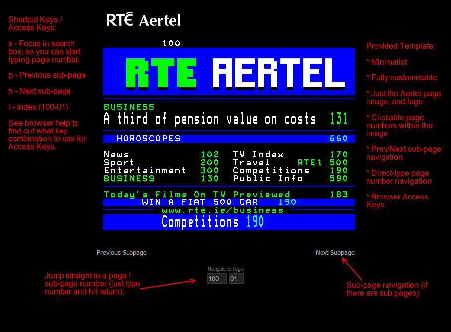

RTÉ Aertel Archiver
===================

A Perl script to scrape RTE.ie Aertel teletext content (before analogue switch-off!). Archives Aertel image data locally, and can render with local HTML template.

Aertel content consists of an image per page (and sub page) with HTML `imagemap`s used for clickable page numbers. This script scrapes the image and map data, and stores locally; 1 HTML file and 1 image file per teletext page/sub-page.

The script also renders all those local HTML files to templated HTML files (using a customisable HTML template), so that you can keep the archived Aertel data and render/re-render it in HTML now or later, without the need to re-download the Aertel content again. A basic sample template is provided.

Usage
-----
The script can be used in two ways. One is to `archive` the data, which downloads the content from RTE.ie, and saves it locally. The other is to `render` it which generates complete HTML files (based on a template) for each page already downloaded/archived.

*  Make the script executable, if it is not already.
*  Switch to the directory containing the script
*  Execute without any arguments to see the argument choices. `./aertel-archiver.pl`

Sample
------
Here''s what the provided sample template looks like; it''s just a minimalist theme with some added navigation features.

Analogue Aertel switch-off [ASO/DSO](http://saorview.ie/about.html)
------------------------------------
This script will cease to be functional when RTÉ turn off Analogue Aertel. They''ve said they intend to do this on ASO date (October 24th, 2012), but it''s unclear if all platforms will be affected (website included). Once the Analogue Aertel has been decommissioned from the website this script will no longer work. RTÉ will continue to offer a [Digital Aertel Service](http://www.rte.ie/aerteldigital/) which is available now.

License
-------
**Copyright 2012 Cathal Garvey. http://cgarvey.ie/**

Licensed under the Apache License, Version 2.0 (the "License"); you may not use this file except in compliance with the License. You may obtain a copy of the License at

http://www.apache.org/licenses/LICENSE-2.0

Unless required by applicable law or agreed to in writing, software distributed under the License is distributed on an "AS IS" BASIS, WITHOUT WARRANTIES OR CONDITIONS OF ANY KIND, either express or implied. See the License for the specific language governing permissions and limitations under the License.

*(Free) commercial licensing available on request.*

